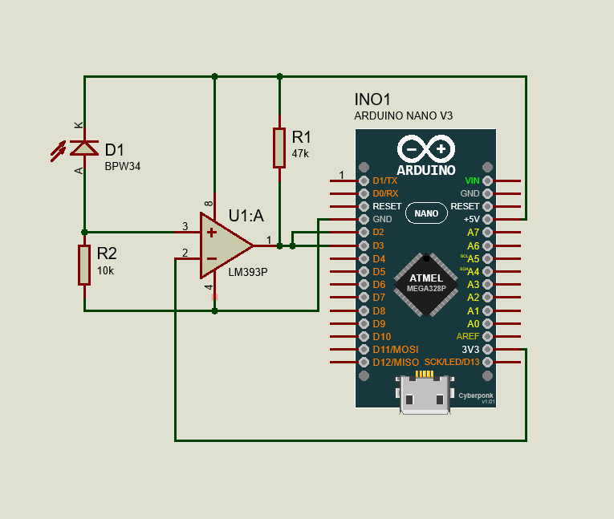

# 📷 Shutterdog
Film camera shutter chronograph made with Arduino.

🔏 **This repo in not maintained. However, feel free to ask any questions through the issues, or fork it and make a better version by yourself.**

The project was inspired by [this article](http://www3.telus.net/public/rpnchbck/shutter%20speed%20tester.html) about measuring shutter speed of vintage Kiev-3 camera. Its author uses a laser, a phototransistor and an oscilloscope to manually measure the time interval of the shutter. You can see pictures of the entire pfocess and of measuring device itself.

I chose to use the `BPW34` photodiode instead, the fastest I could find on the local market. And then I added `LM393P` comparator to make thing more digestible for Arduino.
The final scheme looks like this:

The code returns measuring results in milliseconds. You will need `eRCaGuy_Timer2_Counter` library to run it. [Get it here.](https://gumroad.com/l/eRCaGuy_Timer2_Counter)
It's recommended to repeat the measurement on each shutter speed at least three times.
Finally it's convenient to put results in a table like this:

<table>
<thead>
<tr colspan="4">
<td>Model: **Smena-8M**</td>
</tr>
<tr colspan="4">
<td>Serial No.: **178060**</td>
</tr>
<tr>
<th>No.</th>
<th>Symbol</th>
<th>Estimated duration, ms</th>
<th>Average measured duration, ms</th>
</tr>
</thead>
<tbody>
<tr>
<td>1</td>
<td>2</td>
<td>500</td>
<td></td>
</tr>
<tr>
<td>2</td>
<td>4</td>
<td>250</td>
<td></td>
</tr>
<tr>
<td>3</td>
<td>5</td>
<td>200</td>
<td></td>
</tr>
<tr>
<td>4</td>
<td>8</td>
<td>125</td>
<td></td>
</tr>
<tr>
<td>5</td>
<td>10</td>
<td>100</td>
<td></td>
</tr>
<tr>
<td>6</td>
<td>15</td>
<td>66.7</td>
<td>79</td>
</tr>
<tr>
<td>7</td>
<td>25</td>
<td>40</td>
<td></td>
</tr>
<tr>
<td>8</td>
<td>30</td>
<td>33.3</td>
<td>43</td>
</tr>
<tr>
<td>9</td>
<td>50</td>
<td>20</td>
<td></td>
</tr>
<tr>
<td>10</td>
<td>60</td>
<td>16.7</td>
<td>24.5</td>
</tr>
<tr>
<td>11</td>
<td>125</td>
<td>8</td>
<td>12.4</td>
</tr>
<tr>
<td>12</td>
<td>250</td>
<td>4</td>
<td>4.8</td>
</tr>
<tr>
<td>13</td>
<td>500</td>
<td>2</td>
<td></td>
</tr>
<tr>
<td>14</td>
<td>1000</td>
<td>1</td>
<td></td>
</tr>
<tr>
<td>15</td>
<td>1250</td>
<td>0.8</td>
<td></td>
</tr>
<tr>
<td>16</td>
<td>2000</td>
<td>0.5</td>
<td></td>
</tr>
</tbody>
</table>

